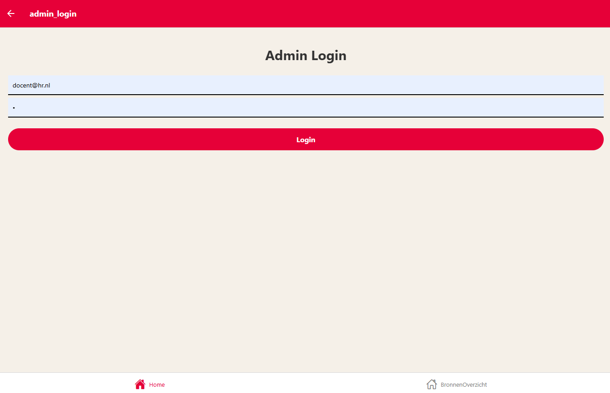
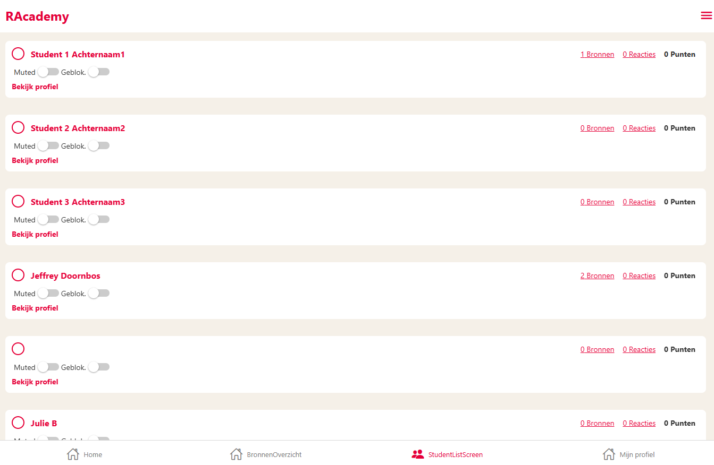
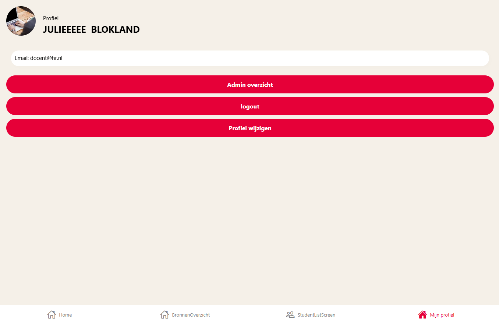
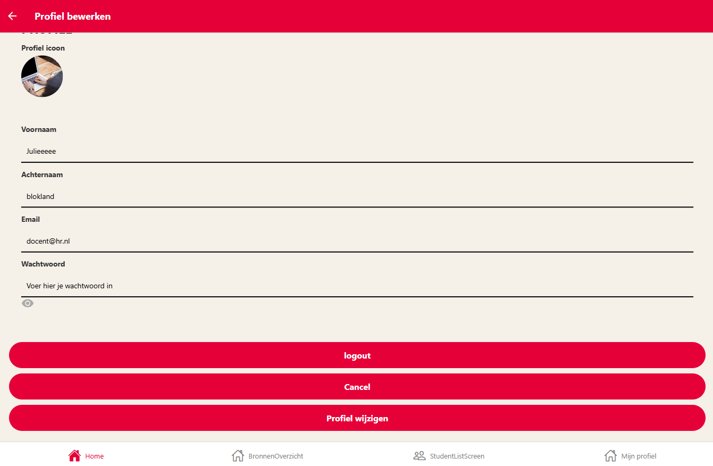
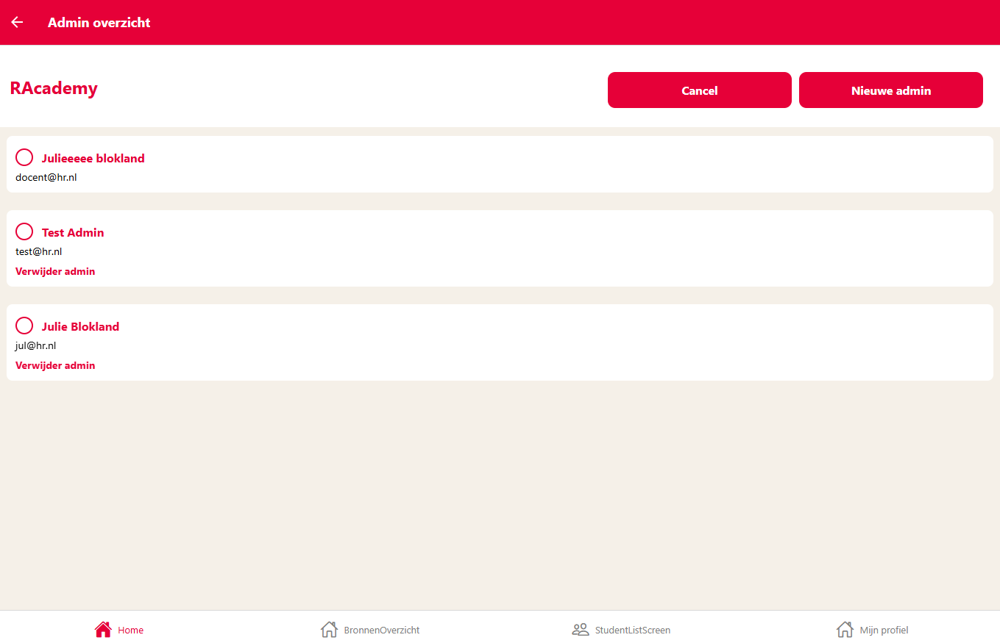
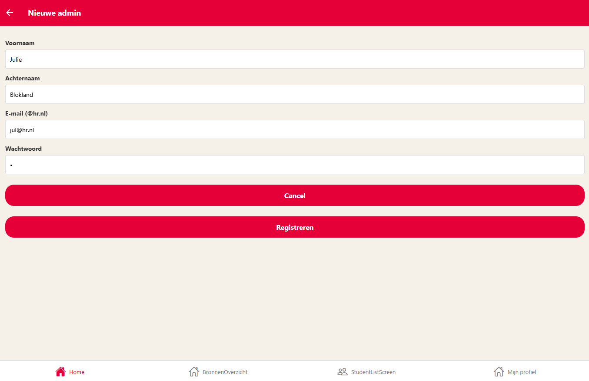

> ### Guide: studenten RACacademy

---

#### Open Docker (eerst) of download de pakketten en maak venv file aan (mocht Docker niet lukken)

Als je nog niks geïnstalleerd hebt, ga terug naar installatie!

---

#### Notificatie

Let op! Als admin kun je geen bronnen aanmaken, aan favorieten toevoegen ect (Dit kan een error geven)!
Je mag ze uiteraard wel bekijken!

---

#### Homepage

* Klik het icoontje om naar de inlog pagina te gaan.

---

#### Inlog scherm

* Je kunt hier registreren of inloggen als student
* Klik door op inloggen als admin
* Email: docent@hr.nl en Wachtwoord: @ om in te loggen als admin
* Klik op registreren

---

#### Studentenlijst scherm

* Je ziet nu een lijst met alle studenten staan
* Je kun vanuit hier studenten muten & blokkeren

----

#### Profiel bekijken student(admin):

* Klik op bekijk profiel
* Hier zie je de gegevens van de student
* Je kan hier ook waarschuwen/muten/blokkeren
* Deze werkt nog niet, als je erop klikt dan start de app opnieuw!

---

#### Profiel student bewerken(admin):

* Bewerk hier de profiel van de student
* Deze werkt nog niet!

---

#### Bronnenlijst

* Je kan gewoon filteren en bronnen bekijken

* Let op! Geen nieuwe bron toevoegen als admin!

----

#### Bronnen details

* Je ziet hier informatie over de bron

* Let op! Niet aan favorieten toevoegen als admin!

----

#### Profiel (admin):

* Bekijk hier je admin profiel
* Profiel bewerken >
* Admin view >

---

#### Profiel bewerken (admin):

* Bewerk hier je admin profiel
* Voeg iets toe/ verander 1 of meerdere

---

#### Admin view

* Hier zie je de admin overzicht
* Verwijderen van een admin (klik op verwijderen, jezelf is niet toegestaan)
* verwijderen werkt, maar de app moet herstart worden (Refresh werkt niet)
* Nieuwe admin aanmaken knop >

---

#### Nieuwe admin

* Maak hier een admin aan.
* Email moet altijd eindigen op @hr.nl

---