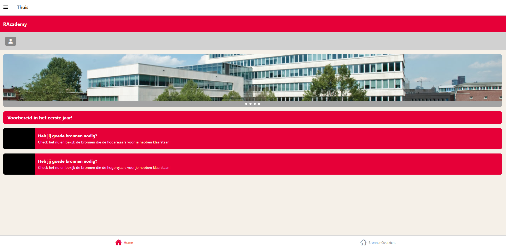
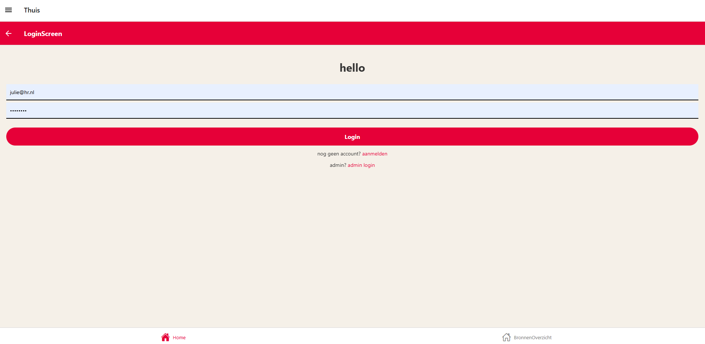
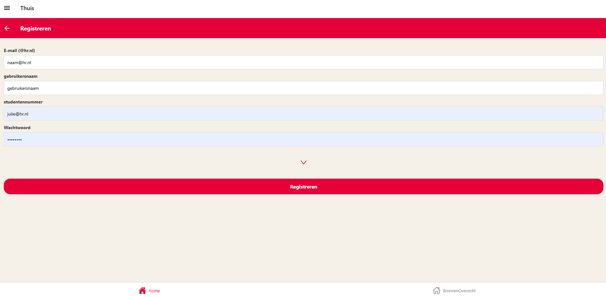
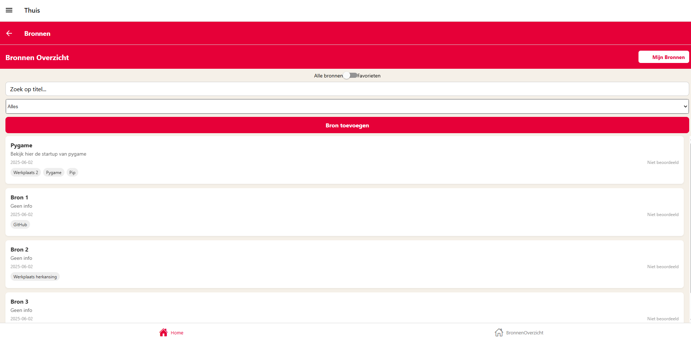
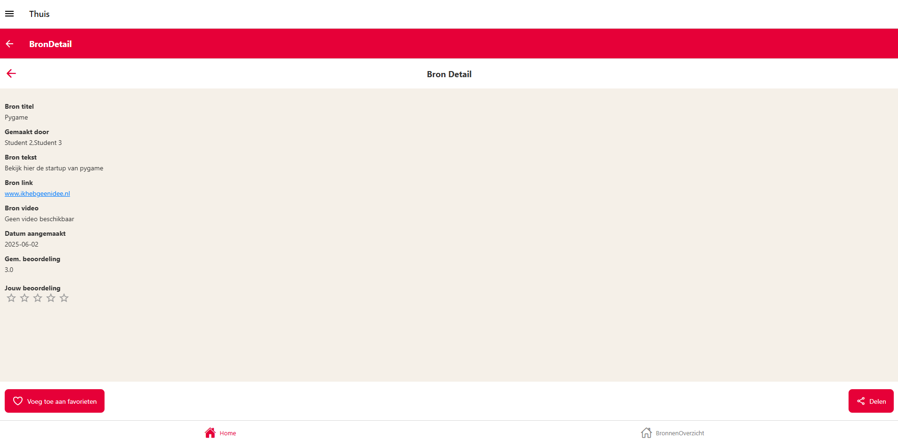
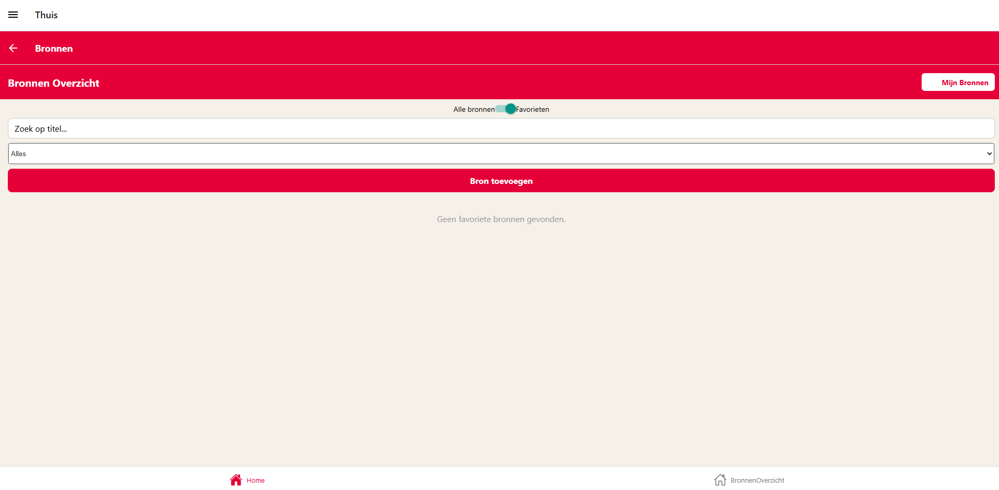
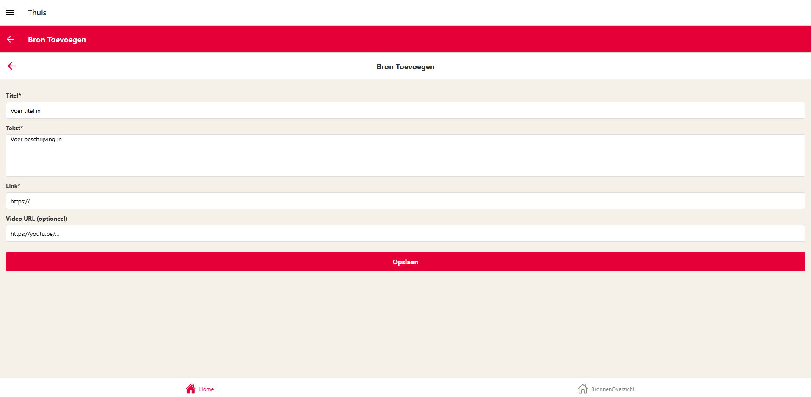
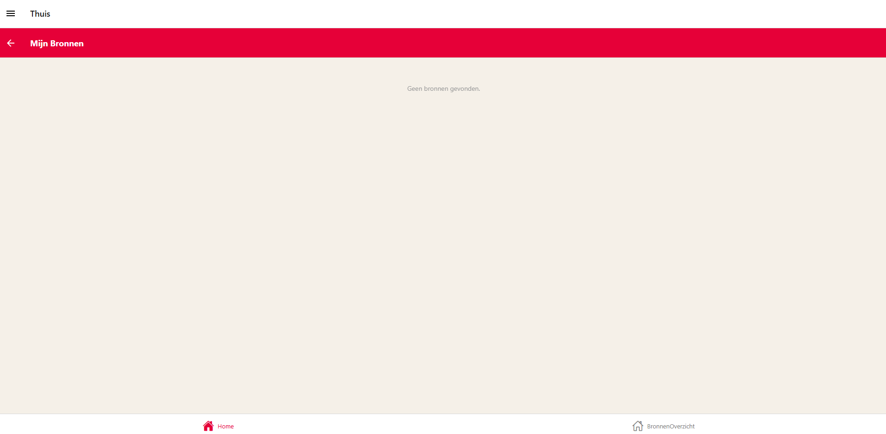
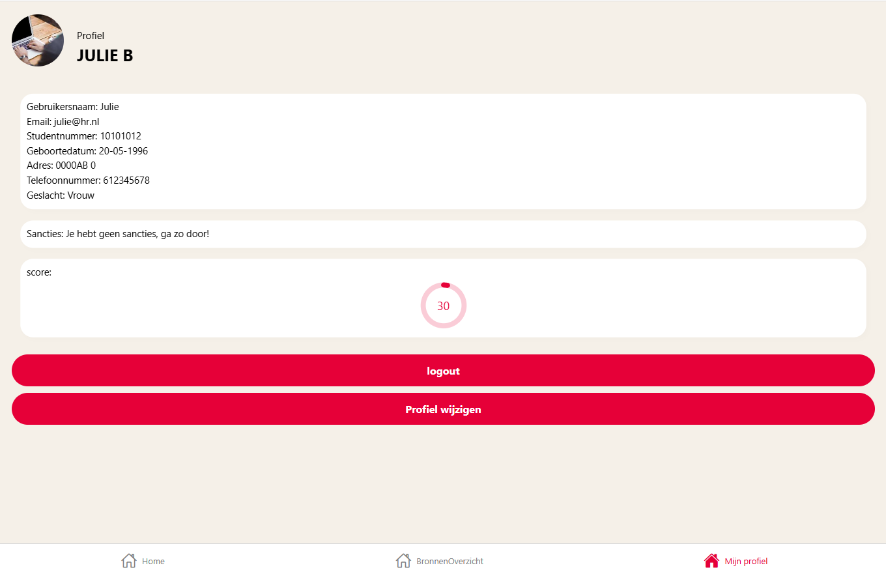
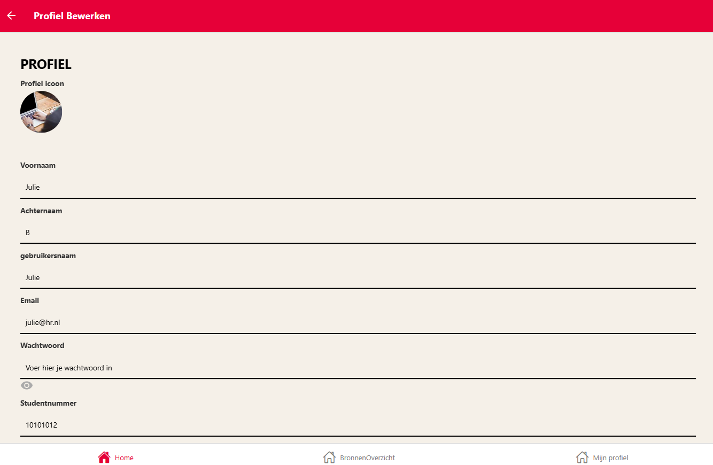

> ### Guide: studenten RACacademy

---

#### Download de pakketten en maak venv file aan

Als je nog niks geinstalleerd hebt, ga terug naar installatie!

---

#### Homepage

* Klik het icoontje om naar de inlog pagina te gaan.

---

#### Inlog scherm

* (Email: julie@hr.nl en Wachtwoord: @) om in te loggen als student of...
* Je kunt hier registreren (student) of inloggen als student/admin
* Klik op registreren >

---

#### registratie scherm

* Maak hier je account aan en eventuele extra opties.

---

#### Bronnen

* Je ziet nu een lijst met alle bronnen staan
* Filteren op naam of tag
* Je kan naar favorieten gaan >
* Je kan naar bron details gaan >
* Je kan een nieuwe bron aanmaken >

----

#### Bron details

* Je kunt hier de bron toevoegen aan favorieten
* Je kunt hier stemmen
* Je ziet hier alle details
* Je kunt de bron ook delen

----

#### favorieten:

* Hier zie je je favorieten, die kun je ook weer verwijderen

---

#### Nieuwe bron:

* Maak hier je nieuwe bron aan

---

#### Mijn bronnen overzicht:

* Hier staan al jou bronnen

---

#### Profiel bekijken:

* Als je ingelogd bent, komt mijn profiel erbij te staan
* Klik onderin op mijn profiel
* Hier zie je informatie over jouw profiel (Al jouw informatie, admins kunnen dit ook zien)
* De profiel pagina heeft ook sancties (Ben je gemute/banned krijg je geen button profiel wijzigen)
* Je score staat hier ook bij, alleen dit is een hardcode
* Geen sancties? Dan kun je door naar profiel bewerken

---

#### Profiel bewerken:

* Hier kun je 1 ding of meerdere dingen aanpassen aan je profiel!
* Tevreden? Klik op profiel wijzigen (onderin), niet veranderen? Cancel

